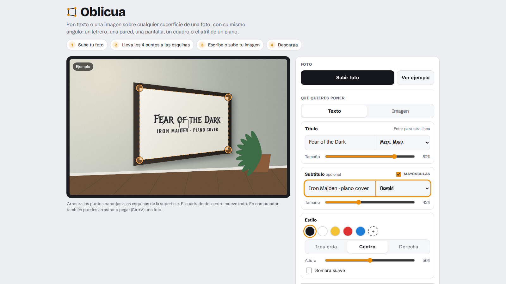

# Oblicua

**Texto e imágenes en perspectiva sobre cualquier foto o video, directo en el navegador.**

👉 [oblicua.netlify.app](https://oblicua.netlify.app/)



Nació para poner el título de mis covers de piano sobre el atril en los videos. Ahora sirve para cualquier superficie: subes una foto o un video, marcas las cuatro esquinas y el texto (o una imagen) se adapta a su ángulo.

## Qué hace

- Título y subtítulo opcional, cada uno con su propia fuente, y opción de mayúsculas.
- Modo imagen: pon un logo o cualquier PNG sobre la superficie.
- **Editor de video**: reproduces el video con el letrero encima, marcas en una línea de tiempo con miniaturas cuándo aparece y desaparece (con transición suave) y descargas el MP4 con el audio original.
- **Cámara en movimiento**: marcas las esquinas en un momento del video y Oblicua sigue la superficie en cada fotograma, aunque salga del encuadre y vuelva a entrar. Si en algún momento se desvía, corriges ahí los puntos y se reparte la corrección por el resto del video.
- Exporta la foto completa o solo el contenido en **PNG transparente**, listo para un editor de video.
- **Video sobre la superficie**: además de texto o una imagen, puedes poner un video (encender un televisor apagado, un video dentro de un cuadro), que empieza cuando aparece el letrero y se repite si es más corto.
- **Luz de la escena**: el letrero se aclara, oscurece y cambia de tono con la luz del video.
- **Detectar tocando**: tocas la superficie y Oblicua pone las 4 esquinas sola.
- **Formato vertical 9:16**, cuadrado o 16:9 para redes, con control de encuadre.
- **Animaciones de entrada** del texto (máquina de escribir, letra por letra, subiendo, acercándose) y **estilo recordado** entre visitas.
- **Manos por delante**: el letrero queda detrás de las personas (manos, brazos, cuerpo) que pasan frente a él, con el segmentador de personas de MediaPipe.
- **Pantallas apagadas y vidrios**: una opción para seguir superficies lisas o que reflejan, siguiendo su marco en vez de sus reflejos.
- **Grabar desde la página** en 1080p o 4K con bitrate alto y el micrófono sin filtros de voz (para que la música suene bien). La cámara que ofrece el selector de archivos del celular graba en baja calidad.
- Lupa de precisión para mover las esquinas, arrastrar y soltar, y pegar desde el portapapeles.
- Todo corre en el navegador: las fotos y videos nunca salen del dispositivo.

## Cómo funciona

- **Homografía** calculada desde cero a partir de las cuatro esquinas; cada píxel de destino se mapea al contenido con la transformación inversa.
- **Remuestreo bilineal con alfa premultiplicado**, para que los bordes del texto queden limpios.
- **Fusión «multiplicar»**, para que el texto parezca impreso sobre la superficie y no pegado encima.
- **Video con WebCodecs**: el contenido deformado se calcula una sola vez como capa transparente y se compone sobre cada fotograma en canvas; [Mediabunny](https://mediabunny.dev) se encarga de leer el archivo, decodificar, codificar a MP4 (H.264 cuando el navegador lo permite) y copiar el audio sin recomprimirlo. El video se exporta en su resolución original y con al menos el bitrate del archivo de entrada, para que volver a codificarlo no le baje la calidad. Respeta la rotación de los videos grabados en vertical.
- **Seguimiento de superficies** (`tracker.js`, sin dependencias): el video se analiza a 640 px, hacia adelante y hacia atrás. Lucas-Kanade piramidal sigue puntos de la superficie de un fotograma al siguiente, RANSAC estima la homografía descartando lo que no está en el plano (gente, muebles), y cada fotograma se ajusta contra la imagen de referencia para que no se acumule error. Cuando la superficie sale del encuadre, descriptores binarios estilo ORB la vuelven a encontrar al entrar. Las dos pasadas se combinan y se suavizan con Savitzky-Golay.
- Con seguimiento, la deformación cambia en cada fotograma, así que se hace en la GPU con WebGL (con la versión en JavaScript como respaldo).
- **Superficies que reflejan**: se ignora el interior y se siguen los 4 bordes del marco (búsqueda de lo grueso a lo fino y Gauss-Newton sobre la distancia de cada borde a su lado), verificando contra la franja que rodea la superficie en la referencia.
- **Personas por delante**: [MediaPipe](https://ai.google.dev/edge/mediapipe/solutions/vision/image_segmenter) (`vendor/mediapipe`, Apache 2.0) estima en cada fotograma dónde hay una persona alrededor del letrero, y esa parte se recorta de la capa antes de fusionarla. Se elige solo entre GPU y CPU según cuál sea más rápido en el dispositivo.
- **Luz de la escena**: se recorre el video a baja resolución, se mide el color de la superficie en una cuadrícula de 4×4 y el letrero se multiplica por su variación respecto de la mediana de todo el video (suavizada en el tiempo).
- **Detectar tocando** (`quad.js`): transformada de Hough sobre los bordes para encontrar las líneas rectas largas, cuadriláteros que contienen el punto tocado, puntuados por el borde real a lo largo de sus lados y afinados lado por lado.
- Sin build: un `index.html` con HTML, CSS y JavaScript, más `tracker.js`, `quad.js`, Mediabunny y MediaPipe en `vendor/`, que solo se descargan al usarlos.

## Uso local

Sírvelo con cualquier servidor estático (abrir el archivo directamente no permite cargar el módulo de video):

```bash
npx serve .
```

## Licencia

MIT © Giovanni Raffa. Mediabunny se distribuye bajo MPL-2.0 (`vendor/MEDIABUNNY-LICENSE`).
